# 🧠 AI-Powered Documentation Analyzer

This project is an AI-powered tool designed to analyze technical documentation pages, evaluate their readability, and extract key headings using a combination of OpenAI APIs and web scraping with Selenium. The front-end is built with Streamlit for a clean and interactive user experience.

---

## 🚀 Setup Instructions

Follow these steps to get the project up and running on your local machine:

### 1. Clone the Repository

```bash
git clone https://github.com/Ranveergit/Documentation_analyzer_v1.git
cd your-main-folder 


```

### Install Dependencies
```bash
pip install -r requirements.txt

```

### Set Up Environment Variables
#Create a .env file in the root directory with the following content:
```bash
OPENAI_API_KEY=your_openai_api_key_here
```

### Run the App
```bash
streamlit run main.py

```


### 📌 Assumptions

- Documentation pages are publicly accessible and do not require login.
- The HTML structure of the documentation contains identifiable headings (`<h1>`, `<h2>`, etc.).
- The user has a valid OpenAI API key and internet access.
- Chrome and ChromeDriver are installed, or are automatically handled by `webdriver_manager`.

---


### 🧠 Design Choices & Approach

#### 🔍 Web Scraping
- **Selenium** is used instead of plain `requests` to handle JavaScript-heavy pages and ensure consistent DOM availability.
- **BeautifulSoup** handles HTML parsing after the page is fully loaded by the browser.

#### 🧾 Readability & Headings
- The `textstat` library evaluates the readability of extracted article content.
- Headings (`<h1>`, `<h2>`, etc.) are parsed and displayed to provide a structural overview of the document.

#### 🎯 Streamlit UI
- Offers a clean and fast interface for entering URLs and viewing analysis results.
- Enables real-time feedback without the need for additional front-end frameworks.

#### 🧹 Style Guidelines (for Rewriting)
- The project interprets **clarity**, **conciseness**, and **helpfulness** as the primary documentation style goals.

---
### ⚙️ Challenges Faced

- **JavaScript Rendering**: Some documentation pages load content dynamically, so using `requests` failed to retrieve meaningful content. This was resolved by switching to Selenium for browser-based rendering.

- **Dynamic Page Load Timing**: Ensuring the content was fully loaded before parsing required using `time.sleep()` or more robust WebDriver wait mechanisms to avoid race conditions.

- **Heading Inconsistencies**: Some pages used inconsistent heading tags or none at all (`<h1>`, `<h2>`, etc.), so fallback strategies were needed to extract meaningful structure.

- **API Rate Limits**: Although not encountered during testing, extended usage should consider implementing caching, rate-limiting, or batching when calling the OpenAI API to stay within quota limits and improve performance.


### example output 1:

URL: https://help.moengage.com/hc/en-us/articles/32665738201108-Android-Native-Integration-Validation#h_01JE5XC6

---

### Image 1: Overview Diagram
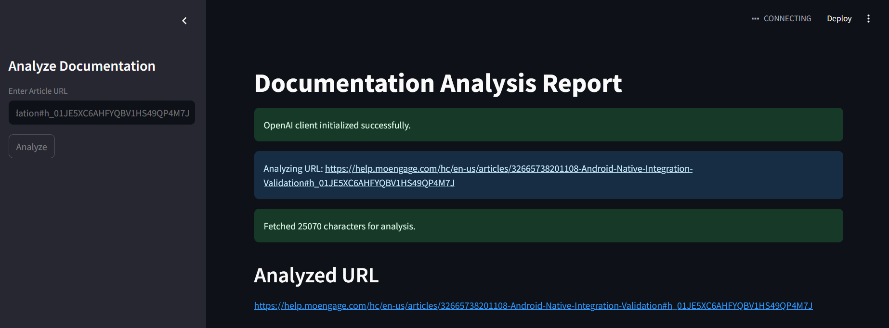

---

### Image 2: sections of analysis : 
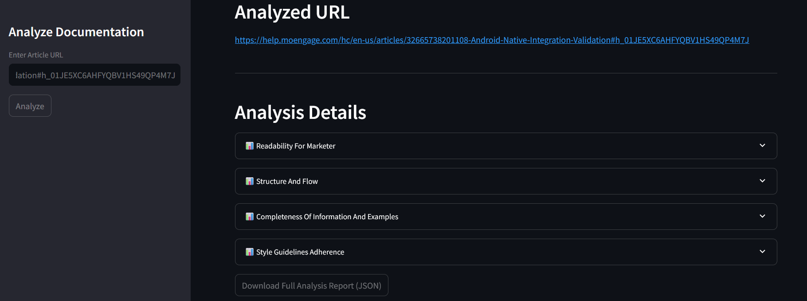

---

### Image 3: analysis for readability for marketer 
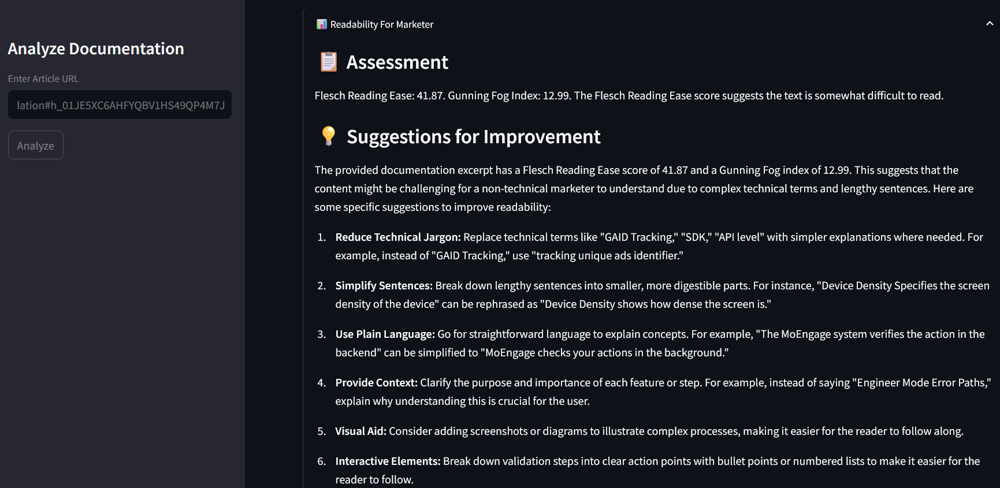

---

### Image 4a:  description of structure and flow analysis :
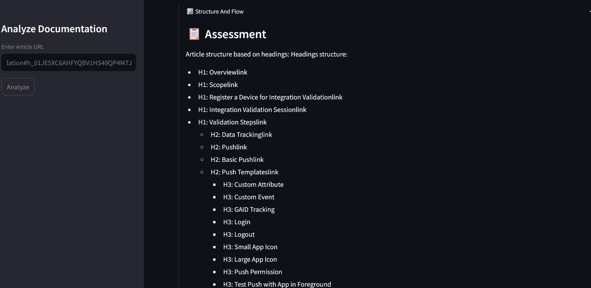

---

### Image 4b: structure and flow analysis part 2 
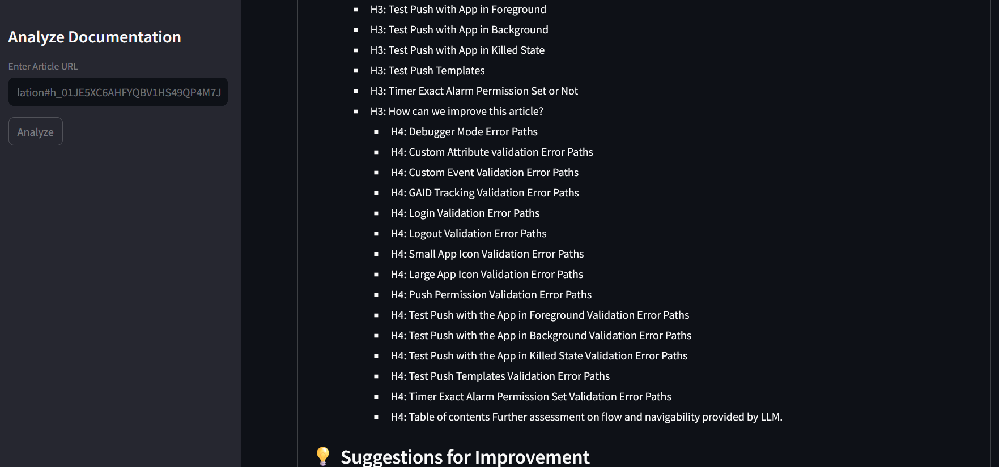

---

### Image 4c: sugession for improvement  of structure and flow analysis : 
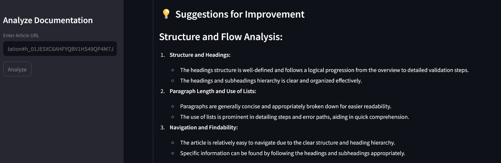

---

### Image 4d: sugession for improvement  of structure and flow analysis - part 2
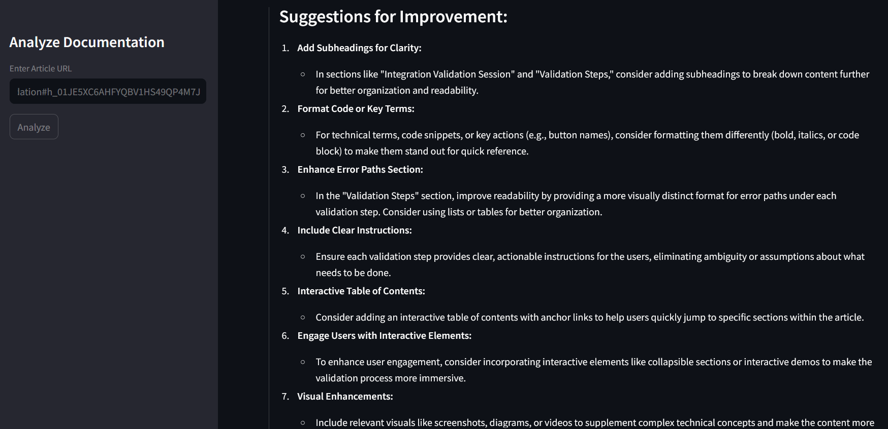

---

### Image 5: analysis of completeness of Information : 
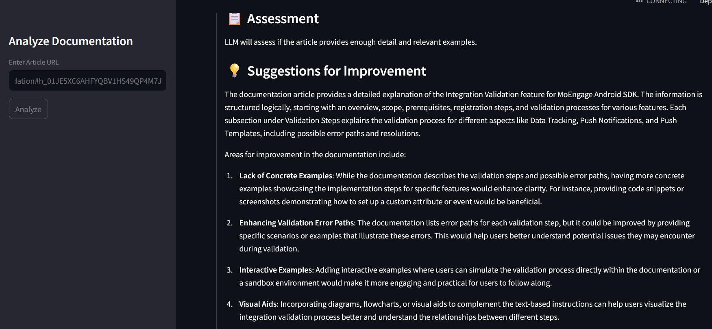

---

### Image 5b: analysis of completeness of Information  - part 2
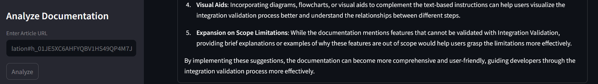

---

### Image 5c: analysis and suggestion for style guideline and adherence 
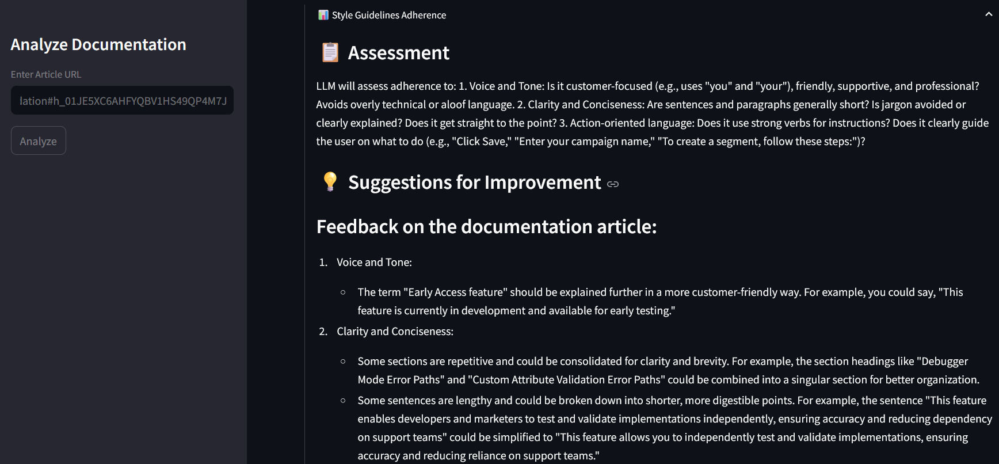

---

### Image 6: analysis and suggestion for style guideline and adherence - part 2
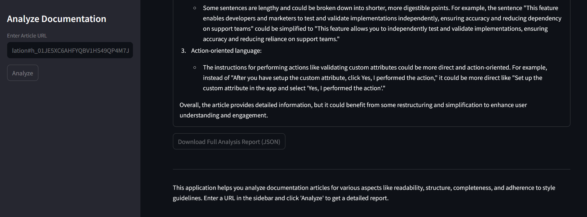


### example output 2:

URL2: https://help.moengage.com/hc/en-us/articles/360042322691-User-Attribute-Profile-Integration-Validation#what-do-we-want-to-validate--0-0

---

### Image 1: Overview Diagram
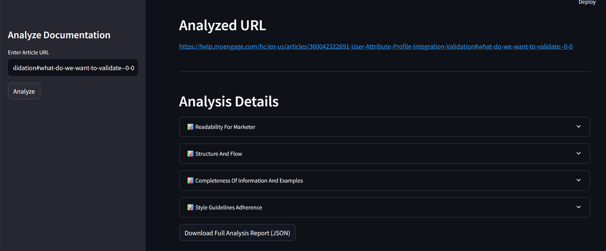

---

### Image 2: sections of analysis : 


---

### Image 3: analysis for readability for marketer 


---

### Image 4a:  description of structure and flow analysis :
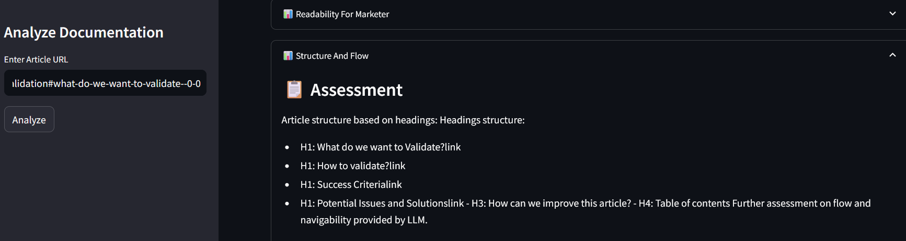

---

### Image 4b: structure and flow analysis part 2 
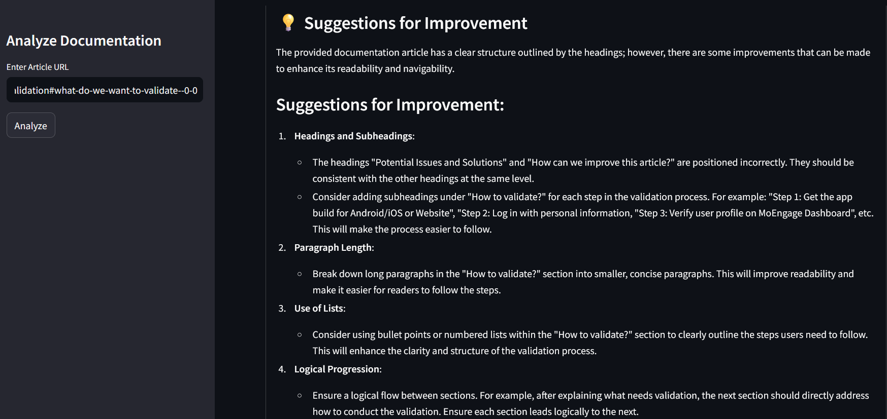

---

### Image 4c: sugession for improvement  of structure and flow analysis : 
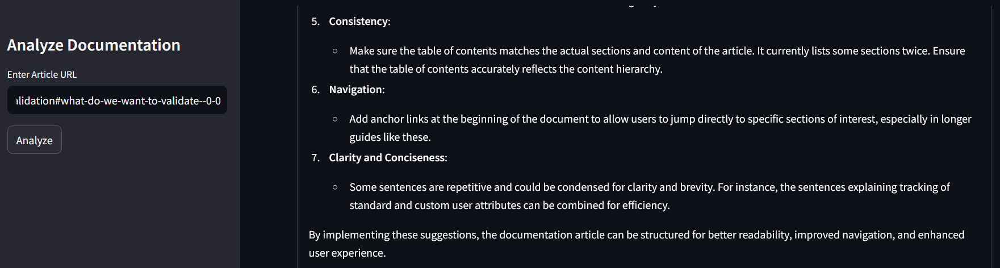

---

### Image 4d: sugession for improvement  of structure and flow analysis - part 2


---

### Image 5: analysis of completeness of Information : 


---

### Image 5b: analysis of completeness of Information  - part 2


---

### Image 5c: analysis and suggestion for style guideline and adherence 
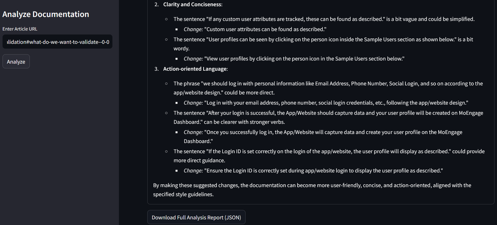

---


